# Database Schema Review
## LeadLover Insights - Supabase Database
### Generated: January 25, 2026

---

## 1) Executive Summary

| Metric | Value |
|--------|-------|
| **Schemas Analyzed** | 1 (public) |
| **Total Tables** | 85 |
| **Total Rows (approx)** | ~19,000 |
| **Tables with RLS** | 85 (100%) ✅ |
| **Foreign Key Constraints** | ~200 |
| **Unique Constraints** | ~32 |

### Notable Architecture Patterns

1. **Multi-Tenant Architecture**: All major tables include `company_id` foreign key with `has_company_access()` RLS function
2. **Dual-Key Referencing**: Tables use both `ghl_id` (TEXT for external GHL IDs) and `id` (UUID for internal) with `*_uuid` columns for migrations
3. **Corporation Hierarchy**: Companies → Corporation parent-child for enterprise multi-company
4. **Portal Token System**: Separate token tables for client, salesperson, estimate, and document portals
5. **Audit Trail**: Comprehensive `audit_logs` + `*_edits` tables tracking changes
6. **Subscription/Feature Gating**: `subscription_plans` → `subscription_features` → `company_subscriptions`

### Top Risks / Improvement Opportunities

| Priority | Risk | Recommendation |
|----------|------|----------------|
| 🟠 Medium | Nullable FKs (`contact_id`, `opportunity_id`) may cause orphan references | Consider adding optional FK constraints on implied relationships |
| 🟠 Medium | `ghl_id` columns lack FK constraints (external refs) | Expected for external system sync - document as implied |
| 🟡 Low | Large tables (`contacts`, `imported_records`, `opportunity_edits`) need pagination | Ensure LIMIT/OFFSET patterns in queries |
| 🟡 Low | Some `*_edits` tables lack company_id filtering indexes | Add composite indexes |
| ✅ Good | 100% RLS coverage | Excellent security posture |

---

## 2) Schema Inventory

### Public Schema (85 Tables)

#### Core Business Tables (High Activity)

| Table | Rows | Purpose |
|-------|------|---------|
| `contacts` | 5,170 | Customer/lead contact records |
| `imported_records` | 4,694 | Import tracking for data migration |
| `contact_notes` | 2,073 | Notes attached to contacts |
| `opportunity_edits` | 1,930 | Opportunity change tracking |
| `audit_logs` | 1,161 | System-wide audit trail |
| `opportunities` | 1,131 | Sales pipeline opportunities |
| `ghl_tasks` | 510 | GoHighLevel task sync |
| `task_edits` | 492 | Task change tracking |
| `portal_view_logs` | 423 | Portal access logging |

#### Financial/Production Tables

| Table | Rows | Purpose |
|-------|------|---------|
| `estimate_line_items` | 232 | Estimate detail line items |
| `project_payment_phases` | 144 | Payment milestones |
| `call_logs` | 147 | Call tracking |
| `project_invoices` | 77 | Invoice records |
| `project_payments` | 73 | Payment records |
| `project_bills` | 49 | Vendor bills |

#### Configuration Tables

| Table | Rows | Purpose |
|-------|------|---------|
| `company_settings` | 52 | Tenant configuration |
| `app_settings` | 23 | Platform-wide settings |
| `app_version` | 17 | Version tracking |
| `subscription_features` | 10 | Feature flags |
| `subscription_plans` | 3 | Subscription tiers |

---

## 3) Table-by-Table Breakdown

### Core Entity Tables

#### `companies`
**Purpose**: Multi-tenant company records (root tenant entity)

| Column | Type | Nullable | Default | Notes |
|--------|------|----------|---------|-------|
| id | uuid | NO | gen_random_uuid() | PK |
| name | text | NO | - | Company name |
| slug | text | YES | - | URL-friendly identifier |
| address | text | YES | - | |
| phone | text | YES | - | |
| corporation_id | uuid | YES | - | FK to corporations |
| created_at | timestamptz | NO | now() | |
| updated_at | timestamptz | YES | now() | |

**Constraints**:
- PK: `id`
- UNIQUE: `slug`
- FK: `corporation_id` → `corporations.id` (NO ACTION)

**Indexes**: 5 (including pk, slug, corporation_id)

---

#### `contacts`
**Purpose**: Customer/lead contact records with GHL sync

| Column | Type | Nullable | Default | Notes |
|--------|------|----------|---------|-------|
| id | uuid | NO | gen_random_uuid() | PK (internal UUID) |
| ghl_id | text | NO | - | External GHL identifier |
| contact_name | text | YES | - | |
| email | text | YES | - | |
| phone | text | YES | - | |
| company_id | uuid | YES | - | FK to companies |
| created_at | timestamptz | NO | now() | |
| custom_fields | jsonb | YES | - | GHL custom field data |
| address | text | YES | - | |

**Constraints**:
- PK: `id`
- UNIQUE: `ghl_id`
- FK: `company_id` → `companies.id`

**Indexes**: 10 (comprehensive coverage including email, phone, name)

---

#### `opportunities`
**Purpose**: Sales pipeline opportunities with dual-key architecture

| Column | Type | Nullable | Default | Notes |
|--------|------|----------|---------|-------|
| id | uuid | NO | gen_random_uuid() | PK (internal UUID) |
| ghl_id | text | NO | - | External GHL identifier |
| name | text | YES | - | Opportunity name |
| contact_id | text | YES | - | GHL contact ID (implied FK) |
| contact_uuid | uuid | YES | - | FK to contacts.id |
| monetary_value | numeric | YES | - | Deal value |
| status | text | YES | - | open/won/lost/abandoned |
| stage | text | YES | - | Pipeline stage |
| address | text | YES | - | Job site address |
| scope_of_work | text | YES | - | |
| company_id | uuid | YES | - | FK to companies |
| salesperson_id | uuid | YES | - | FK to salespeople |

**Constraints**:
- PK: `id`
- UNIQUE: `ghl_id`
- FK: `company_id` → `companies.id`, `salesperson_id` → `salespeople.id`, `contact_uuid` → `contacts.id`

**Indexes**: 7 (including status, stage, company_id)

---

#### `appointments`
**Purpose**: Calendar appointments with multi-source sync (GHL, Google, Local)

| Column | Type | Nullable | Default | Notes |
|--------|------|----------|---------|-------|
| id | uuid | NO | gen_random_uuid() | PK |
| ghl_id | text | YES | - | GHL appointment ID |
| google_event_id | text | YES | - | Google Calendar event ID |
| contact_id | text | YES | - | GHL contact ID (implied) |
| contact_uuid | uuid | YES | - | FK to contacts |
| salesperson_id | uuid | YES | - | FK to salespeople |
| company_id | uuid | YES | - | FK to companies |
| sync_source | text | YES | - | 'ghl', 'google', 'local' |
| start_time | timestamptz | YES | - | |
| end_time | timestamptz | YES | - | |
| status | text | YES | - | |

**Constraints**:
- PK: `id`
- UNIQUE: `ghl_id`, `(provider, external_id)`
- FK: 6 FKs including company, contact_uuid, salesperson

**Indexes**: 7 (comprehensive for calendar queries)

---

#### `projects`
**Purpose**: Production/project management records

| Column | Type | Nullable | Default | Notes |
|--------|------|----------|---------|-------|
| id | uuid | NO | gen_random_uuid() | PK |
| project_number | integer | YES | - | Auto-increment project # |
| project_name | text | YES | - | |
| opportunity_id | text | YES | - | GHL opportunity ID (implied) |
| opportunity_uuid | uuid | YES | - | FK to opportunities |
| contact_id | text | YES | - | GHL contact ID (implied) |
| contact_uuid | uuid | YES | - | FK to contacts |
| company_id | uuid | YES | - | FK to companies |
| status | text | YES | - | |
| project_address | text | YES | - | |
| contract_value | numeric | YES | - | |

**Constraints**:
- PK: `id`
- FK: 5 FKs including opportunity_uuid, contact_uuid, company_id

**Indexes**: 6 (including project_number, company_id)

---

#### `estimates`
**Purpose**: Estimate/proposal/contract documents

| Column | Type | Nullable | Default | Notes |
|--------|------|----------|---------|-------|
| id | uuid | NO | gen_random_uuid() | PK |
| estimate_number | integer | YES | - | |
| estimate_title | text | YES | - | |
| customer_name | text | YES | - | |
| opportunity_id | text | YES | - | GHL opportunity ID (implied) |
| opportunity_uuid | uuid | YES | - | FK to opportunities |
| contact_id | text | YES | - | GHL contact ID (implied) |
| contact_uuid | uuid | YES | - | FK to contacts |
| project_id | uuid | YES | - | FK to projects |
| company_id | uuid | YES | - | FK to companies |
| status | text | YES | 'draft' | draft/sent/signed/declined |
| total | numeric | YES | - | |

**Constraints**:
- PK: `id`
- FK: 7 FKs (comprehensive)

**Indexes**: 2

---

### Authentication & Authorization

#### `profiles`
**Purpose**: Extended user profile data (linked to auth.users)

| Column | Type | Nullable | Default | Notes |
|--------|------|----------|---------|-------|
| id | uuid | NO | - | PK, FK to auth.users |
| email | text | YES | - | |
| full_name | text | YES | - | |
| company_id | uuid | YES | - | FK to companies |
| ghl_user_id | text | YES | - | GHL user mapping |

**Constraints**:
- PK: `id`
- FK: `id` → `auth.users.id` (CASCADE), `company_id` → `companies.id`

---

#### `user_roles`
**Purpose**: Role-based access control (separate table - security best practice ✅)

| Column | Type | Nullable | Default | Notes |
|--------|------|----------|---------|-------|
| id | uuid | NO | gen_random_uuid() | PK |
| user_id | uuid | NO | - | FK to auth.users |
| role | app_role | NO | - | Enum: super_admin, admin, sales, production, contract_manager |

**Constraints**:
- PK: `id`
- UNIQUE: `(user_id, role)`
- FK: `user_id` → `auth.users.id` (CASCADE)

---

### Portal Token Tables

| Table | Token For | Unique Constraint |
|-------|-----------|-------------------|
| `client_portal_tokens` | Project/Estimate client access | `token` |
| `estimate_portal_tokens` | Estimate-specific access | `token` |
| `salesperson_portal_tokens` | Salesperson app access | `token` |
| `document_portal_tokens` | Document signing access | - |

All include: `company_id`, `is_active`, `expires_at`, `created_by`

---

### Audit & Tracking Tables

| Table | Purpose | Row Count |
|-------|---------|-----------|
| `audit_logs` | System-wide change log | 1,161 |
| `appointment_edits` | Appointment change tracking | 107 |
| `opportunity_edits` | Opportunity change tracking | 1,930 |
| `task_edits` | Task change tracking | 492 |
| `note_edits` | Note change tracking | ~50 |
| `magazine_sales_edits` | Magazine sale edits | 4 |

---

## 4) Relationship Map

### Core Business Relationships

```
Corporation (1) ──────────< Companies (N)
     │
     └── Company is the root tenant; all data flows through company_id

Company (1) ──────────< Contacts (N)
     │                      │
     │                      └──< Contact Notes (N)
     │
     ├──────────< Opportunities (N)
     │                 │
     │                 ├──< Estimates (N)
     │                 │        │
     │                 │        ├──< Estimate Groups (N)
     │                 │        │        └──< Estimate Line Items (N)
     │                 │        │
     │                 │        └──< Estimate Payment Schedule (N)
     │                 │
     │                 └──< Projects (N)
     │                          │
     │                          ├──< Project Payment Phases (N)
     │                          ├──< Project Invoices (N)
     │                          ├──< Project Payments (N)
     │                          ├──< Project Bills (N)
     │                          │        └──< Bill Payments (N)
     │                          ├──< Project Documents (N)
     │                          ├──< Project Costs (N)
     │                          └──< Project Agreements (N)
     │
     ├──────────< Appointments (N)
     │                 └──< Appointment Reminders (N)
     │
     ├──────────< Salespeople (N)
     │                 └──< Salesperson Portal Tokens (N)
     │
     ├──────────< GHL Tasks (N)
     │
     └──────────< Company Settings (N)
```

### Authentication Relationships

```
auth.users (1) ──────────< Profiles (1:1)
     │                        │
     │                        └── company_id ──> Companies
     │
     └──────────< User Roles (N)
                      └── role: super_admin | admin | sales | production | contract_manager
```

---

## 5) Constraint Integrity Review

### ✅ Strong Constraints

| Pattern | Status | Notes |
|---------|--------|-------|
| All tables have UUID PKs | ✅ Excellent | Consistent `gen_random_uuid()` |
| User roles in separate table | ✅ Secure | Prevents privilege escalation |
| Cascade on user deletion | ✅ | `user_roles` CASCADE, prevents orphans |
| Company cascade protection | ✅ | NO ACTION prevents accidental company deletion |

### 🟠 Implied Relationships (No FK Constraint)

| Table | Column | Implied Target | Risk |
|-------|--------|----------------|------|
| opportunities | contact_id (TEXT) | contacts.ghl_id | Medium - external ref |
| appointments | contact_id (TEXT) | contacts.ghl_id | Medium - external ref |
| projects | opportunity_id (TEXT) | opportunities.ghl_id | Medium - external ref |
| estimates | opportunity_id (TEXT) | opportunities.ghl_id | Medium - external ref |

**Mitigation**: UUID columns (`contact_uuid`, `opportunity_uuid`) exist with proper FKs for internal use.

### ⚠️ Cascade Delete Behaviors

| Source Table | FK Column | Target | ON DELETE | Risk |
|--------------|-----------|--------|-----------|------|
| `bill_payments` | bill_id | project_bills | CASCADE | ⚠️ Deleting bill removes payments |
| `client_comments` | estimate_id | estimates | CASCADE | ⚠️ Deleting estimate removes comments |
| `client_comments` | project_id | projects | CASCADE | ⚠️ Deleting project removes comments |
| `billing_history` | company_id | companies | CASCADE | ⚠️ Deleting company removes history |
| `estimate_*` | estimate_id | estimates | CASCADE | ⚠️ Estimate deletion cascades to all children |

**Recommendation**: Consider SOFT DELETE patterns for financial records.

### 🟡 Nullable FK Concerns

| Table | Column | Nullable | Concern |
|-------|--------|----------|---------|
| Most tables | company_id | YES | Should be NOT NULL for multi-tenant |
| opportunities | salesperson_id | YES | Acceptable (unassigned opps) |
| appointments | salesperson_id | YES | Acceptable (unassigned appts) |

---

## 6) Index & Performance Review

### ✅ Well-Indexed Tables

| Table | Index Count | Assessment |
|-------|-------------|------------|
| contacts | 10 | Excellent - covers all query patterns |
| opportunities | 7 | Good coverage |
| appointments | 7 | Good for calendar queries |
| ghl_tasks | 7 | Good coverage |
| audit_logs | 6 | Appropriate for time-series |

### 🟠 Tables Needing Pagination

| Table | Row Count | Recommendation |
|-------|-----------|----------------|
| contacts | 5,170 | ✅ Already uses keyset pagination |
| imported_records | 4,694 | Ensure LIMIT in queries |
| contact_notes | 2,073 | Paginate by contact_id |
| opportunity_edits | 1,930 | Paginate by opportunity_id + date |
| audit_logs | 1,161 | Paginate by changed_at DESC |

### 🟡 Suggested Missing Indexes

```sql
-- Composite index for opportunity filtering
CREATE INDEX idx_opportunities_company_status ON opportunities(company_id, status);

-- Composite for estimate queries
CREATE INDEX idx_estimates_company_status ON estimates(company_id, status);

-- Project payment phase lookups
CREATE INDEX idx_project_payment_phases_project ON project_payment_phases(project_id, sort_order);
```

---

## 7) Security / RLS Review

### ✅ RLS Status: 100% Enabled

All 85 tables have Row-Level Security enabled.

### Policy Patterns Used

| Pattern | Tables | Description |
|---------|--------|-------------|
| `has_company_access(company_id)` | ~60 | Multi-tenant isolation |
| `is_admin(auth.uid())` | ~15 | Admin-only operations |
| `has_role(auth.uid(), 'role')` | ~20 | Role-based access |
| `is_super_admin(auth.uid())` | ~10 | Platform admin access |
| `has_valid_*_portal_token()` | ~5 | Anonymous portal access |

### Policy Summary by Table Type

| Table Category | SELECT | INSERT | UPDATE | DELETE |
|----------------|--------|--------|--------|--------|
| Core Business (contacts, opps) | Company-scoped | Company-scoped | Company-scoped | Admin |
| Financial (invoices, payments) | Company-scoped | Production/Admin | Production/Admin | Admin |
| Portal Tokens | Auth'd + Anon lookup | Admin | Admin | Admin |
| Settings | Company-scoped | Admin | Admin | Admin |
| Audit Logs | Company-scoped | Any auth'd | ❌ | ❌ |

### 🟢 Security Strengths

1. **User roles in separate table** - Prevents privilege escalation
2. **Security definer functions** - Avoids RLS recursion
3. **Portal token validation** - Safe anonymous access
4. **Anon access is read-only** - Write operations require auth
5. **Multi-tenant isolation** - Consistent `has_company_access()` pattern

### 🟡 Security Notes

| Finding | Table | Recommendation |
|---------|-------|----------------|
| `USING (true)` on SELECT | app_version, project_statuses, project_types, subscription_features | Expected - shared lookup data |
| Anon can read branding settings | app_settings, company_settings | Expected - portal branding |

---

## 8) ERD Diagram (Mermaid)

```mermaid
erDiagram
    corporations ||--o{ companies : "owns"
    companies ||--o{ contacts : "has"
    companies ||--o{ opportunities : "has"
    companies ||--o{ appointments : "has"
    companies ||--o{ projects : "has"
    companies ||--o{ estimates : "has"
    companies ||--o{ salespeople : "has"
    companies ||--o{ ghl_tasks : "has"
    companies ||--o{ company_settings : "has"
    companies ||--o{ company_integrations : "has"
    companies ||--o{ google_calendar_connections : "has"
    companies ||--o{ client_portal_tokens : "issues"
    companies ||--o{ audit_logs : "tracks"
    companies ||--o{ banks : "has"
    companies ||--o{ subcontractors : "has"
    companies ||--o{ scope_submissions : "receives"
    
    contacts ||--o{ contact_notes : "has"
    contacts ||--o{ opportunities : "linked_to"
    contacts ||--o{ appointments : "linked_to"
    contacts ||--o{ projects : "linked_to"
    contacts ||--o{ estimates : "linked_to"
    contacts ||--o{ ghl_tasks : "assigned"
    contacts ||--o{ conversations : "has"
    contacts ||--o{ call_logs : "has"
    
    opportunities ||--o{ estimates : "generates"
    opportunities ||--o{ projects : "converts_to"
    opportunities ||--o{ opportunity_edits : "tracked_by"
    opportunities ||--o{ opportunity_sales : "tracked_by"
    
    estimates ||--o{ estimate_groups : "contains"
    estimate_groups ||--o{ estimate_line_items : "contains"
    estimates ||--o{ estimate_payment_schedule : "has"
    estimates ||--o{ estimate_signers : "requires"
    estimate_signers ||--o{ estimate_signatures : "signs"
    estimates ||--o{ estimate_portal_tokens : "accessed_via"
    estimates ||--o{ estimate_attachments : "has"
    estimates ||--o{ client_comments : "has"
    
    projects ||--o{ project_payment_phases : "has"
    projects ||--o{ project_invoices : "has"
    projects ||--o{ project_payments : "receives"
    projects ||--o{ project_bills : "has"
    project_bills ||--o{ bill_payments : "paid_by"
    projects ||--o{ project_documents : "has"
    projects ||--o{ project_costs : "tracks"
    projects ||--o{ project_agreements : "has"
    projects ||--o{ project_notes : "has"
    project_notes ||--o{ project_note_comments : "has"
    projects ||--o{ project_commissions : "pays"
    projects ||--o{ client_portal_tokens : "accessed_via"
    projects ||--o{ portal_chat_messages : "has"
    projects ||--o{ project_checklists : "has"
    projects ||--o{ project_feedback : "receives"
    
    salespeople ||--o{ appointments : "attends"
    salespeople ||--o{ opportunities : "owns"
    salespeople ||--o{ salesperson_portal_tokens : "uses"
    salespeople ||--o{ scope_submissions : "submits"
    salespeople ||--o{ commission_payments : "receives"
    salespeople ||--o{ magazine_sales : "records"
    
    appointments ||--o{ appointment_reminders : "has"
    appointments ||--o{ appointment_edits : "tracked_by"
    
    ghl_tasks ||--o{ task_edits : "tracked_by"
    
    signature_documents ||--o{ document_signers : "requires"
    document_signers ||--o{ document_signatures : "signs"
    document_signers ||--o{ document_signature_fields : "fills"
    signature_documents ||--o{ document_portal_tokens : "accessed_via"
    
    auth_users ||--o| profiles : "has"
    auth_users ||--o{ user_roles : "has"
    profiles }o--|| companies : "belongs_to"
    
    ghl_users }o--|| companies : "belongs_to"
    ghl_calendars }o--|| companies : "belongs_to"
    ghl_pipelines }o--|| companies : "belongs_to"
    
    subscription_plans ||--o{ subscription_features : "includes"
    subscription_plans ||--o{ company_subscriptions : "subscribed_by"
    company_subscriptions ||--o{ billing_history : "has"
```



---

## Document Information

| Field | Value |
|-------|-------|
| Generated | January 25, 2026 |
| Database | mspujwrfhbobrxhofxzv (Supabase) |
| Tool | Lovable AI Database Architect |

---

**End of Database Schema Review**
